# Diagram Architektury UI - Moduł Autentykacji

<architecture_analysis>

## 1. Komponenty wymienione w plikach referencyjnych

### Layouts (Astro)
- `AuthLayout` - layout dla stron publicznych (logowanie, rejestracja, reset hasła)
- `AppShellLayout` - layout dla stron chronionych z pełną nawigacją

### Strony Astro
- `/auth/login` (login.astro) - strona logowania
- `/auth/register` (register.astro) - strona rejestracji
- `/auth/reset-password` (reset-password.astro) - **NOWA** - żądanie resetu hasła
- `/auth/update-password` (update-password.astro) - **NOWA** - ustawienie nowego hasła
- `/` (index.astro) - strona główna z przekierowaniem
- `/generate` (generate.astro) - generator fiszek AI
- `/flashcards` (flashcards.astro) - lista fiszek użytkownika
- `/generations` (generations.astro) - historia generacji
- `/settings` (settings.astro) - ustawienia konta
- `/study` (study.astro) - **NOWA** - sesja nauki

### Komponenty Auth (React)
- `AuthForm` - główny komponent formularza (wymaga rozszerzenia o nowe tryby)
- `AuthFormFields` - pola formularza (warunkowe wyświetlanie)
- `AuthLinks` - linki pomocnicze (dostosowanie do trybów)
- `AuthError` - wyświetlanie błędów autentykacji
- `PasswordInput` - pole hasła z toggle widoczności
- `useAuthForm` - hook zarządzania formularzem (rozszerzenie o reset/update)
- `ResetPasswordSuccess` - **NOWY** - komunikat sukcesu po wysłaniu linku

### Komponenty Navigation (React)
- `NavigationShell` - główny wrapper responsywnej nawigacji
- `Sidebar` - boczny panel na desktop
- `TopBar` - górny pasek na mobile
- `BottomNav` - dolna nawigacja na mobile
- `UserMenu` - menu użytkownika z wylogowaniem
- `NavItem` - pojedynczy element nawigacji
- `ThemeToggle` - przełącznik motywu
- `ThemeProvider` - kontekst motywu
- `useAuth` - hook sesji użytkownika (**wymaga reimplementacji**)

### Backend
- `middleware/index.ts` - **wymaga pełnej reimplementacji** (weryfikacja sesji, ochrona tras)
- `supabase.client.ts` - klient Supabase browser-side
- `supabase.server.ts` - **NOWY** - klient Supabase server-side dla SSR
- `env.d.ts` - rozszerzenie typu Locals

### API Endpoints (do modyfikacji)
- `/api/flashcards` - użycie locals.user zamiast DEFAULT_USER_ID
- `/api/flashcards/[id]` - użycie locals.user
- `/api/generations` - użycie locals.user
- `/api/generations/[id]` - użycie locals.user
- `/api/generation-error-logs` - użycie locals.user
- `/api/auth/callback` - **NOWY** - callback OAuth/email confirmation
- `/api/auth/delete-account` - **NOWY** - usunięcie konta (RODO)

## 2. Główne strony i odpowiadające komponenty

| Strona | Layout | Komponenty React |
|--------|--------|------------------|
| `/auth/login` | AuthLayout | AuthForm(mode="login") |
| `/auth/register` | AuthLayout | AuthForm(mode="register") |
| `/auth/reset-password` | AuthLayout | AuthForm(mode="reset-password") |
| `/auth/update-password` | AuthLayout | AuthForm(mode="update-password") |
| `/generate` | AppShellLayout | NavigationShell, GenerateView |
| `/flashcards` | AppShellLayout | NavigationShell, FlashcardsView |
| `/generations` | AppShellLayout | NavigationShell, GenerationsView |
| `/settings` | AppShellLayout | NavigationShell, DeleteAccountDialog |
| `/study` | AppShellLayout | NavigationShell, StudyView |

## 3. Przepływ danych

1. **Middleware (SSR)** → weryfikacja sesji → przekazanie user do locals
2. **Layouts (Astro)** → odczyt locals.user → przekazanie do komponentów React
3. **AuthForm** → Supabase Auth API → przekierowanie po sukcesie
4. **NavigationShell** → useAuth hook → obsługa wylogowania
5. **API Endpoints** → locals.user → serwisy bazodanowe z user.id

## 4. Funkcjonalność komponentów

### Komponenty wymagające aktualizacji
- **AuthForm** - nowe tryby: reset-password, update-password
- **AuthFormFields** - warunkowe wyświetlanie pól
- **AuthLinks** - linki dla każdego trybu
- **useAuthForm** - logika resetowania i aktualizacji hasła
- **useAuth** - pełna integracja z Supabase Auth
- **middleware** - weryfikacja sesji, ochrona tras, przekierowania
- **AppShellLayout** - pobieranie user z locals
- **UserMenu** - rzeczywisty email z sesji

### Nowe komponenty
- **ResetPasswordSuccess** - komunikat po wysłaniu linku
- **DeleteAccountDialog** - dialog usunięcia konta
- **supabase.server.ts** - klient SSR z obsługą cookies

```mermaid
flowchart TD
    %% Definicje stylów
    classDef newComponent fill:#90EE90,stroke:#228B22,stroke-width:2px
    classDef modifiedComponent fill:#FFD700,stroke:#DAA520,stroke-width:2px
    classDef existingComponent fill:#87CEEB,stroke:#4682B4,stroke-width:1px
    classDef layout fill:#DDA0DD,stroke:#8B008B,stroke-width:2px
    classDef page fill:#F0E68C,stroke:#BDB76B,stroke-width:1px
    classDef backend fill:#FFA07A,stroke:#FF4500,stroke-width:2px

    %% ========================================
    %% WARSTWA MIDDLEWARE I BACKEND
    %% ========================================
    subgraph "Warstwa Backend"
        MW["Middleware SSR"]:::modifiedComponent
        SSC["supabase.server.ts"]:::newComponent
        SBC["supabase.client.ts"]:::existingComponent
        ENV["env.d.ts - Locals"]:::modifiedComponent
        
        MW --> SSC
        SSC --> ENV
    end

    subgraph "API Endpoints"
        APIF["API Flashcards"]:::modifiedComponent
        APIG["API Generations"]:::modifiedComponent
        APIE["API Error Logs"]:::modifiedComponent
        APIAC["API Auth Callback"]:::newComponent
        APIAD["API Delete Account"]:::newComponent
    end

    MW --> APIF
    MW --> APIG
    MW --> APIE
    MW --> APIAC
    MW --> APIAD

    %% ========================================
    %% WARSTWA LAYOUTÓW
    %% ========================================
    subgraph "Layouty Astro"
        AL["AuthLayout"]:::existingComponent
        ASL["AppShellLayout"]:::modifiedComponent
    end

    MW --"user = null"--> AL
    MW --"user z sesji"--> ASL

    %% ========================================
    %% STRONY PUBLICZNE - AUTENTYKACJA
    %% ========================================
    subgraph "Strony Publiczne"
        PL["login.astro"]:::existingComponent
        PR["register.astro"]:::existingComponent
        PRP["reset-password.astro"]:::newComponent
        PUP["update-password.astro"]:::newComponent
        PI["index.astro"]:::modifiedComponent
    end

    AL --> PL
    AL --> PR
    AL --> PRP
    AL --> PUP
    PI --"Przekierowanie"--> PL
    PI --"Przekierowanie"--> PG

    %% ========================================
    %% STRONY CHRONIONE
    %% ========================================
    subgraph "Strony Chronione"
        PG["generate.astro"]:::existingComponent
        PF["flashcards.astro"]:::existingComponent
        PGN["generations.astro"]:::existingComponent
        PS["settings.astro"]:::modifiedComponent
        PST["study.astro"]:::newComponent
    end

    ASL --> PG
    ASL --> PF
    ASL --> PGN
    ASL --> PS
    ASL --> PST

    %% ========================================
    %% KOMPONENTY AUTH
    %% ========================================
    subgraph "Komponenty Autentykacji"
        AF["AuthForm"]:::modifiedComponent
        AFF["AuthFormFields"]:::modifiedComponent
        ALK["AuthLinks"]:::modifiedComponent
        AE["AuthError"]:::existingComponent
        PI2["PasswordInput"]:::existingComponent
        RPS["ResetPasswordSuccess"]:::newComponent
        UAF["useAuthForm"]:::modifiedComponent
    end

    PL --> AF
    PR --> AF
    PRP --> AF
    PUP --> AF
    
    AF --> AFF
    AF --> ALK
    AF --> AE
    AF --> UAF
    AFF --> PI2
    AF --> RPS

    UAF --"signInWithPassword"--> SBC
    UAF --"signUp"--> SBC
    UAF --"resetPasswordForEmail"--> SBC
    UAF --"updateUser"--> SBC

    %% ========================================
    %% KOMPONENTY NAWIGACJI
    %% ========================================
    subgraph "Komponenty Nawigacji"
        NS["NavigationShell"]:::existingComponent
        SB["Sidebar"]:::existingComponent
        TB["TopBar"]:::existingComponent
        BN["BottomNav"]:::existingComponent
        UM["UserMenu"]:::modifiedComponent
        NI["NavItem"]:::existingComponent
        TT["ThemeToggle"]:::existingComponent
        TP["ThemeProvider"]:::existingComponent
        UA["useAuth"]:::modifiedComponent
    end

    ASL --"userEmail"--> NS
    NS --> SB
    NS --> TB
    NS --> BN
    NS --> TP
    NS --> UA
    
    SB --> NI
    SB --> UM
    SB --> TT
    TB --> UM
    TB --> TT
    
    UM --> UA
    UA --"signOut"--> SBC
    UA --"onAuthStateChange"--> SBC

    %% ========================================
    %% KOMPONENTY SETTINGS
    %% ========================================
    subgraph "Komponenty Ustawień"
        DAD["DeleteAccountDialog"]:::newComponent
    end

    PS --> DAD
    DAD --> APIAD

    %% ========================================
    %% PRZEPŁYWY AUTENTYKACJI
    %% ========================================
    subgraph "Przepływy Auth"
        direction LR
        FL1["Logowanie"]:::existingComponent
        FL2["Rejestracja"]:::existingComponent
        FL3["Reset Hasła"]:::newComponent
        FL4["Nowe Hasło"]:::newComponent
        FL5["Wylogowanie"]:::existingComponent
        FL6["Usunięcie Konta"]:::newComponent
    end

    AF -.-> FL1
    AF -.-> FL2
    AF -.-> FL3
    AF -.-> FL4
    UM -.-> FL5
    DAD -.-> FL6

    %% ========================================
    %% LEGENDA
    %% ========================================
    subgraph "Legenda"
        L1["Nowy komponent"]:::newComponent
        L2["Zmodyfikowany"]:::modifiedComponent
        L3["Istniejący"]:::existingComponent
    end
```

</architecture_analysis>

<mermaid_diagram>

</mermaid_diagram>

## Podsumowanie zmian

### Nowe komponenty (zielone)
| Komponent | Lokalizacja | Opis |
|-----------|-------------|------|
| `reset-password.astro` | `src/pages/auth/` | Strona żądania resetu hasła |
| `update-password.astro` | `src/pages/auth/` | Strona ustawienia nowego hasła |
| `study.astro` | `src/pages/` | Strona sesji nauki (chroniona) |
| `supabase.server.ts` | `src/db/` | Klient Supabase dla SSR |
| `ResetPasswordSuccess` | `src/components/auth/` | Komunikat sukcesu reset hasła |
| `DeleteAccountDialog` | `src/components/settings/` | Dialog usunięcia konta |
| `API Auth Callback` | `src/pages/api/auth/` | Callback dla auth |
| `API Delete Account` | `src/pages/api/auth/` | Endpoint usunięcia konta |

### Komponenty do modyfikacji (żółte)
| Komponent | Zakres zmian |
|-----------|--------------|
| `middleware/index.ts` | Pełna reimplementacja - sesja, ochrona tras |
| `AuthForm` | Rozszerzenie o tryby reset-password i update-password |
| `AuthFormFields` | Warunkowe wyświetlanie pól w zależności od trybu |
| `AuthLinks` | Dostosowanie linków dla każdego trybu |
| `useAuthForm` | Dodanie logiki resetowania i aktualizacji hasła |
| `useAuth` | Pełna reimplementacja - integracja z Supabase Auth |
| `UserMenu` | Wykorzystanie rzeczywistego emaila z sesji |
| `AppShellLayout` | Pobieranie user z locals |
| `env.d.ts` | Rozszerzenie typu Locals o user |
| `index.astro` | Przekierowanie na podstawie sesji |
| `settings.astro` | Implementacja funkcji usunięcia konta |
| `API Flashcards` | Użycie locals.user zamiast DEFAULT_USER_ID |
| `API Generations` | Użycie locals.user |
| `API Error Logs` | Użycie locals.user |

### Przepływy użytkownika

1. **Logowanie**: `/auth/login` → AuthForm(login) → signInWithPassword → `/generate`
2. **Rejestracja**: `/auth/register` → AuthForm(register) → signUp → `/generate`
3. **Reset hasła**: `/auth/reset-password` → AuthForm(reset-password) → resetPasswordForEmail → komunikat
4. **Nowe hasło**: `/auth/update-password` → AuthForm(update-password) → updateUser → `/auth/login`
5. **Wylogowanie**: UserMenu → useAuth.logout → signOut → `/auth/login`
6. **Usunięcie konta**: Settings → DeleteAccountDialog → API Delete Account → `/auth/login`
